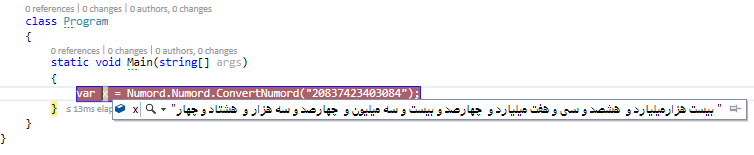
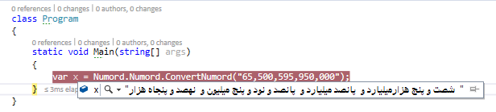
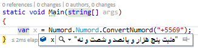
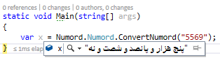
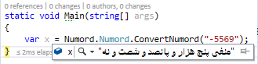
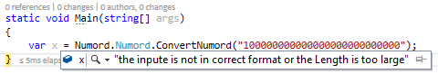

# Numord
 
Convert Integer to Persian Words for C#.Net Users 

>> 1 - Add the .dll in <i>..\Numord\Numord\Numord\obj\Debug</i> to your Project refrences

>> 2 - Follow the imgages below								  

 -> Be Carefull that the target framework is .NetFramework 4.5.2

 Examples :  

<h2> >> Sign Number Support :</h2>

<h2> >> High Range(-999999999999999 to +999999999999999) :</h2>

<h2> >> Error and Exception Handling :</h2>

<h2> >> Versions Feature :</h2>

<h3> 1.0 </h3>
<ul>
    <li>Converting Numbers to Word in Range of integer</li>
</ul>
<h3> 2.0 </h3>
<ul>
    <li>Fixed Bugs</li>
    <li>Add Sign Support</li>
    <li>Expande the Range to Int64</li>
</ul>
<h3> 3.0 </h3>
<ul>
    <li>Create a FUCKING .java Code for Project with alot of Bugs</li>
<ul>
<li> 3.1</li>
    <li>Finally the JAVA Code is Usable</li>
</ul>
    </li>
</ul>
